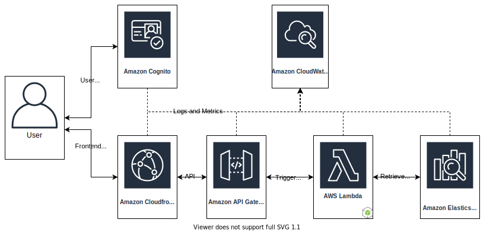

A company asked me to design their infrastructure as part of an interview. This seems like free work, but hey, it makes a good post and is a fun exercise.

# Prompt

As we scale, we need to streamline our code deployment and infrastructure to be as efficient and robust as possible so that we can iterate quickly. These are some of the challenges that you’d be solving.

## Problem

1. What tools/processes do you use for cloud infrastructure management, security, and auditing?
2. We are a small, fast moving startup. With this in mind, how would you think about build vs buy?
3. How would you construct a CI/CD pipeline on AWS with a [React frontend](https://reactjs.org/), [NodeJS backend](https://nodejs.org/en/), and pool of worker jobs?
4. How would you setup an [ElasticSearch](https://www.elastic.co/elasticsearch/) cluster for search with 100 million records in it, mostly free text across multiple languages?

# Answers

I'm going to tackle these questions using only AWS services because I know them and I know that they work well together. These questions can be answered in a lot of different ways with varying amounts of development and managements costs associated with them. Let's just assume that the cost of going with an AWS provided solution is still less than hiring more engineers to build it all yourself.

## Tools

Let's break this down into a couple different sections:

1. Code Management and Process
2. Infrastructure
3. Security & Auditing

### Code Management and Process

All of your code needs to be in version control system, preferably `git`. It should be pushed to a hosted system like [GitHub](https://github.com), [GitLab](https://gitlabs.com), [BitBucket](https://bitbucket.com), or [CodeCommit](https://aws.amazon.com/codecommit/). You should be using a [GitHub Flow](https://guides.github.com/introduction/flow/) style of development so that you can iterate quickly on your code. This system focuses on short lived code branches with frequent merges of code into a main branch. Releases are done from this main branch. Releases are defined as [Git Tags](https://git-scm.com/book/en/v2/Git-Basics-Tagging) which can then trigger the continuous deployment system to start a deployment. 

All code needs to be reviewed by someone else before it gets merged into the main branch. The culture of the team needs to be built around reviewing the code constructively and efficiently. Changes to the code base need to be small, with a general rule of thumb that you shouldn't be changing more that 100 lines in any given pull request. Doing meaningful code review needs to be prioritized higher than starting new features. Technical Debt is very hard to get rid of and having a system of thoughtful review helps keep that at bay.

Depending on the size of the team and the amount of work that needs to be done, there are a couple of different ways to plan work. You will want some way to track deficiencies in the code and new product features. Most of the hosted git systems have builtin issue tracking and project management products that are free or included with your per-user cost. For technical teams, these make the most sense because they can be integrated directly into the code review process. 

If you want something that is a bit more general purpose, there are a ton of options out there. [Jira](https://www.atlassian.com/software/jira) is the industry incumbent, but I really wouldn't recommend using it. There are a ton of different SASS products out there for doing project management and they all offer free tiers/trials. Trying out a couple and finding which ever one makes the most sense for your workflow makes a lot of sense. 

### Infrastructure

For managing your infrastructure, it really depends on what you envision for your product in the future. Do you have any plans of moving off of AWS to another Cloud provider? Do you need to host fully separated instances of your product for other organizations, either internal to their infrastructure or cloud? Let's just assume that we're going to stay on AWS for right now.

For defining and configuring all of the infrastructure and services, there are a couple of different options in AWS. You could do everything manually if there really wasn't a large footprint of services. This would be the cheapest upfront cost in terms of time and engineering resources, but you wouldn't be able to replicate or change this easily. Another option would be to use [AWS CloudFormation](https://aws.amazon.com/cloudformation/), which is a YAML-based configuration tool for configuring all aspects of AWS's services. These configuration are committed into a repository and deployed automatically.

Another option is [Terraform](https://www.terraform.io/),  which allows for a unified way to configure many different services across all of the cloud providers. It also supports configuration of applications that might be deployed into instances instead of just managed services.

The benefit of using CloudFormation over Terraform is that there is usually Day 1 support for new products directly in CloudFormation. Terraform is probably a better choice if you ever plan to move to a different cloud provider or want to go multi-platform. Terraform has larger learning curve, but in my opinion is a better product for infrastructure definition.

If you want to spend a lot of time and build a custom solution, you can interface with all of the cloud providers using just their APIs. I've done it for some specific application deployments, but it really is overkill. You can also use something like [Terraform CDK](https://github.com/hashicorp/terraform-cdk), which is powerful but also pretty overkill for React + Node application.

You need some way to metric your application and collect application logs. There a lot of services out there to accomplish this, but it makes the most sense to just use AWS CloudWatch. This way you don't need to ship your logs out to these services and pay for the AWS egress traffic. You can set up alarms to alert if particular metrics are breached. 

### Security & Auditing

At a bare minimum, you need to have dependency scanning set up for your node application to alert you if any of your dependencies have vulnerabilities. This is a very easy and free thing to do with GitHub's [Dependabot](https://dependabot.com/). This will even open up pull requests to update your dependencies automatically. You will also want to set up some sort of static security analysis tool like [SonarCloud](https://sonarcloud.io/) or [ShiftLeft](https://www.shiftleft.io/). These scan through the code itself and surface any security issues they identify. These are also both managed services meaning that there is no infrastructure to manage and maintain.

You will also want to set up some sort of active scanning of your infrastructure using a tool like [Tenable](https://www.tenable.com/) to check your APIs and public facing infrastructure. This will alert you if anything is deployed that wasn't caught by any of the other checks. It will also detect if anything new is opened up that you didn't expect, like a known command and control port.

All of the public parts of the web application should be behind [AWS Web Application Firewall](https://aws.amazon.com/waf/) with rules in place to protect against unauthorized usage of the app. AWS WAF can limit a lot of common threats like cross site scripting and SQL injection. These may not matter to the web application right now, but you can also set up limits like no more than X number of requests from a single client in a single time period, acting as a simple denial of service prevention. All internal parts of the infrastructure needs to be within a private Virtual Private Cloud(VPC). Internal services can communicate with each other in a private IP range(10.X.X.X) and traffic within the VPC is considered internal and private. The only way for anyone to access any of the data provided by the application is through the public API.

For auditing, you can use [AWS Audit Manager](https://aws.amazon.com/audit-manager/), which audits your AWS usage and helps keep your AWS usage within compliance of a particular standard. Auditing is also a lot easier if everything, from application design to development process, is documented before you start the process. These processes should also meet whatever the requirements of a particular certification requires.

You can also set up something like [Amazon Macie](https://aws.amazon.com/macie/) on your CloudWatch logs and metrics. This scans through the logs in real time and alerts you if it finds anything that shouldn't be happening, like S3 buckets changing from private to public, or disabling of security protections. Macie can also be configured to alert anytime it detects changes that would bring you out of compliance with any regulation or standard.

## Build vs Buy

There is no question on which one you should do, **buy**. Building and deploying a web application is a solved problem. There is nothing you are doing that sounds incredibly custom, and instead you should be focusing your engineering efforts on building out your product, rather than custom solutions.

From what it sounds like, the company has a high margin product, with a low amount of concurrent users. Building and deploying a web application using managed serverless solutions that can automatically scale when demand increases in the future sounds like the best approach.

## CI/CD Pipeline

A Continuous Deployment pipeline requires something to deploy and something to deploy into. Let's start with identifying the components:

- React Frontend
- User authentication
- NodeJS backend components
- ElasticSearch database

### Application Design

The React Frontend can be deployed directly to [Amazon CloudFront](https://aws.amazon.com/cloudfront/) so that we can leverage AWS's fast content delivery network. CloudFront plus the DNS settings configured in Route53 should all be configured statically using something like CloudFormation or Terraform. CloudFront allows for distributing the web application in a 

Users authenticate to the application using [Amazon Cognito](https://aws.amazon.com/cognito/). Depending on how the sales process works, there would either be a sign-up process with a way to purchase access to the product after the account as been created, or the account is created for the customer and provided to them after purchase. Cognito makes a lot of sense over rolling your own authentication system due to the tight interoperability you can get with all the rest of the AWS services. It also scales pretty well with the business. The first 50,000 users are free and if the business isn't providing any sort of free tier, all of the customer accounts should fit within the free tier.

As an authenticated user uses the React application, the application makes requests back to AWS into [API Gateway](https://aws.amazon.com/api-gateway/). Each call to the API is able to be routed to a particular location, like a container or an EC2 instance, or it can trigger a [Lambda](https://aws.amazon.com/lambda/) to run. AWS Lambda is way to run code in the cloud without running it it something like a container. Amazon takes care of all of the infrastructure and you only pay for the number times the function is called and how long it takes the function to run. Depending on how long it takes to retrieve data for a particular request, Lambda is a very cost effective way to do server-side compute with internal resources.

The application can also be configure to only trigger the request, return a promise, and wait for the data to become available. If you needed a very long running task, you could set up something with [AWS Fargate](https://aws.amazon.com/fargate/), for serverless containers. A Lambda could spin up the ECS task in Fargate, the task could run, and then drop the data in [Amazon S3]((https://aws.amazon.com/s3/)) when it is done processing it. Access to the S3 bucket can then be provided to the user for a short duration to retrieve the data before the data is removed. For the sake of this design though, we will assume all of the requests to the data layer can be done in the maximum duration of a Lambda.

The data layer will be [AWS ElasticSearch Service](https://aws.amazon.com/elasticsearch-service/), which is AWS's managed ElasticCache. This allows for a tight integration with all of the AWS services and we can provision access into this for the Lambda functions. If it makes sense, the data layer can also include [S3](https://aws.amazon.com/s3/) for more durable, large storage, and [DynamoDB](https://aws.amazon.com/dynamodb/) for a simple NoSQL database. If there was a need for a relational database, the data layer could also include a flavor of [Amazon RDS](https://aws.amazon.com/rds/). As with the compute design, for the sake of simplicity, we will assume the data layer only includes ElasticSearch. ElasticSearch Service can be configured and managed using the AWS's built in tools and provide access to the service using IAM and Cognito.

All of the logs for each piece of this design will be sent to CloudWatch with metrics for each of these services also configured to send alerts based on usage.

### Pipeline

The pipeline to deploy this system will be done around a single mono repository. While many teams work well around having separate applications and components versioned separately, managing service interoperability can become a challenge. To prevent this from happening and ensuring that every that is deployed can be easily tested and verified, the entire product will live within a single repository. Several pipelines will be created to handle deploying the infrastructure, the services, and managing the data. New releases and deployments will be triggered by tags to the repository.

For the sake of this design, lets assume the code is stored in CodeCommit and the pipeline will be done using [AWS CodePipeline](https://aws.amazon.com/codepipeline/). CodePipeline is a continuous delivery service built into AWS. The pipeline will build all of the different application, test them, package them every single commit. When a tag is created in the CodeCommit repository it will go ahead and deploy them to the infrastructure.

#### Integration

Every single commit pushed to the repository will be ran through unit tests, linters, and static code analysis. The status of these tests will be presented back to CodeCommit and becomes visible for each commit and part of the Pull Request process. Pull Requests can be blocked from merging if any of the checks fail and should be enable to keep code quality up.

When a branch is being used for a Pull Request, the changes in the branch should also be tested in an ephemeral testing environment for integration testing. Something like [Robot Framework](https://robotframework.org/) can be used for doing this deep integration testing, where you would verify that your product is working as expected. You can write integration tests that exercise various features or components of the system and verify they are all working as expected together.

#### Deployment

There are a lot of different ways to handle deployment, but for this design we will use Canary releases as our particular deployment strategy. This means that we will slowly roll out the changes to the application and check for any bad behavior. If we see an increase in errors or alarms, we will revert the deployment back to the previous version. This entire process can be [enabled automatically](https://docs.aws.amazon.com/apigateway/latest/developerguide/canary-release.html) in API gateway.

If a separate environment for testing or staging is required, rather than always deploying to production, a separate deployment pipeline can be created for each of these environments. You can also build in an automatic promotion system for deploying these changes automatically on a time basis to each of these different environments.

The configuration for all of these deployments is done via CloudFormation and applied with the CodePipeline itself. Everything will be defined as code.

## ElasticSearch Cluster

I've never touched any of the Elastic products or really used an ELK stack, but it is super popular. I've looked through both the [ElasticSearch sizing documentation](https://www.elastic.co/blog/found-sizing-elasticsearch) and the [AWS ElasticSearch Service sizing documentation](https://docs.aws.amazon.com/elasticsearch-service/latest/developerguide/sizing-domains.html) and I think I have a rough idea of how the system should look.

Setting up a cluster to scale to the size of 100M items shouldn't be a challenge in AWS as long as you are fine throwing money at the problem. The question is kind of hard to answer though because I don't know a lot of different parameters.

 - Size of the records
 - How many indices
 - Frequency of requests
 - Number of concurrent requests
 - Most important features of ElasticSearch for the product

Let's just design a generic system that is fault-tolerant and can handle a dozen terabytes of data. We'll start with 3 `c6g.xlarge.elasticsearch` instances spread across availability zones for our dedicated master nodes. A dedicated master node performs cluster management tasks, but does not hold data or respond to data upload requests, so only one of the instances will be active at a given time. We'll then add 18 `r6g.xlarge.elasticsearch` as the rest of the nodes in the cluster. This will let us store around 14TB of data.

### Compute

| Instance | vCPU | Memory (GiB) | Price ($/hr) | Nodes | Total ($/month) |
| :-------------: | :---: | :---: | :---: | :---: | :---: |
| `c6g.xlarge.elasticsearch` | 4 | 8 | 0.113 | 3 | 224.08 |
| `r6g.xlarge.elasticsearch` | 4 | 32 | 0.335 | 18 | 4341.60 |

### Storage

| EBS Type | Node Size | Price ($/GB-Month) | Nodes | Total ($/month) |
| :---: | :---: | :---: | :---: | :---: |
| `gp3` | 64 | 0.08 | 3 | 15.36 | 
| `gp3` | 3800 | 0.08 | 18 | 5472.00 | 

The grand-total for this system would be $10,053.04 per month for the compute and storage. In terms of the actual tuning of performance for this cluster, the node sizes and types will need to be tested and modified as needed. For more information of best practices for ElasticSearch, refer to the [AWS documentation](https://docs.aws.amazon.com/elasticsearch-service/latest/developerguide/aes-bp.html).

## Conclusion

This was a fun exercise and had me looking more into how all of these different AWS services interact to make sure they do what I expect them to do. I had never looked into the sizing requirements of an ElasticSearch cluster before, but now I understand all of the requirements you need to size a cluster.

The goal for the entire architecture design was to build something that is scalable and that you only pay for during use. The worst thing you can do is spin up a whole bunch of hardware and pay for something that nobody is actively using. Ideally, you'd come up with a monetization strategy that made sure every single request coming into the product could be charged back to the customer. Infrastructure is a solved problem, but the needs and requests of your customers are not. Going with all managed and serverless solutions should allow for the development team to really focus on the product development rather than the infrastructure.